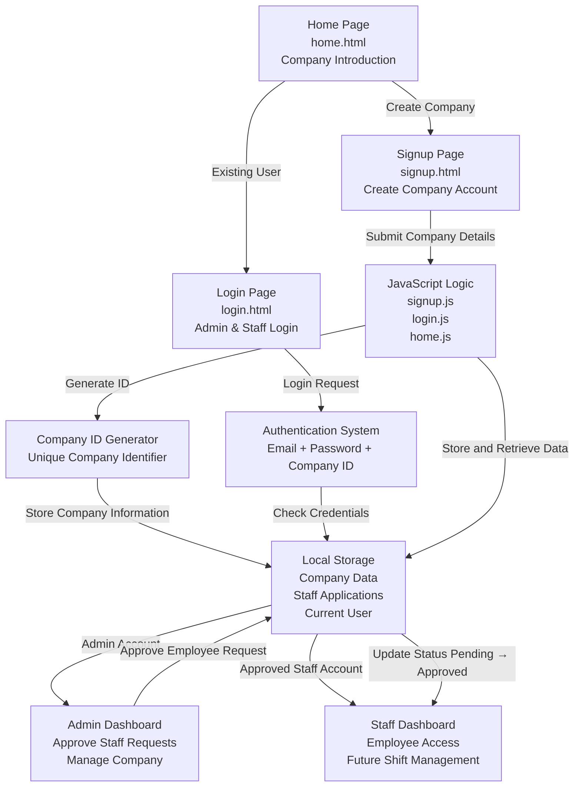

# Shifty

Employee Management and Shift Scheduling System


Shifty is a web-based employee management platform designed to help companies organize their workforce, manage staff access, and simplify employee onboarding.

Companies can create their own workspace, generate a unique Company ID, and allow employees to request access. Managers can review and approve employee requests before granting system access.

---

# The Problem

Many small businesses manage employees using spreadsheets, messages, or manual systems. This can create problems such as:

- Difficult employee management
- Poor communication between managers and staff
- No proper access control
- Time-consuming staff onboarding

Shifty provides a simple solution by combining company registration, employee approval, and role-based access into one platform.

---

# What Shifty Does

| Feature | Description |
|---------|-------------|
| Company Registration | Businesses can create their own company account |
| Unique Company ID | Each company receives a unique identification code |
| Staff Registration | Employees can request access using company details |
| Approval System | Managers approve or reject employee requests |
| Role-Based Login | Different access for administrators and staff |
| Password Validation | Ensures stronger user passwords |
| Responsive Design | Works across different screen sizes |
| Image Slider | Modern visual interface on authentication pages |

---

## Architecture



# User Roles

## Administrator

The company owner/manager can:

- Create a company account
- Receive employee requests
- Approve staff accounts
- Manage company users
- Access administrator dashboard


## Staff Member

Employees can:

- Register using company ID
- Request access to a company
- Login after approval
- Access staff dashboard

---

# Technology Stack

| Layer | Technology |
|------|------------|
| Frontend | HTML |
| Styling | CSS |
| Programming | JavaScript |
| Data Storage | Browser Local Storage |
| Version Control | Git & GitHub |

---

# Project Structure

```
CW2_Grp-C_Client/
│
├── html/ # All website pages
│ ├── index.html # Landing page
│ ├── signup.html # Company registration page
│ ├── login.html # User login page
│ ├── terms.html # Terms and Conditions
│ ├── success.html # Successful registration page
│ ├── admin_dashboard.html # Admin dashboard page
│ └── staff_dashboard.html # Staff dashboard page
│
├── css/ # Website styling files
│ ├── style.css # Home page styling
│ ├── signup.css # Signup page styling
│ ├── login.css # Login page styling
│ ├── admin_dashboard.css # Admin dashboard page styling
│ └── staff_dashboard.css # Staff dashboard page styling
│
│
├── js/ # JavaScript functionality
│ ├── script.js # Navigation and home page scripts
│ ├── signup.js # Company and staff registration logic
│ ├── login.js # Authentication and role checking
│ ├── admin_dashboard.js # Admin_dashboard
│ └── staff_dashboard.js # staff dashboard 

│
├── images/ # Website images
│ ├── image1.jpg # Login/Home background image
│ ├── image2.jpg
│ ├── image3.jpg
│ └── image4.jpg
│
├── README.md # Project documentation
│
└── .gitignore # Git ignored files
```